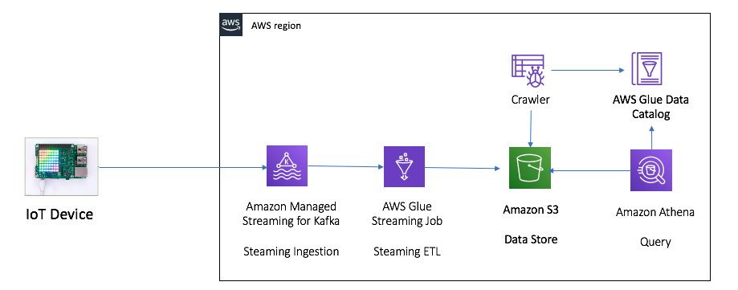
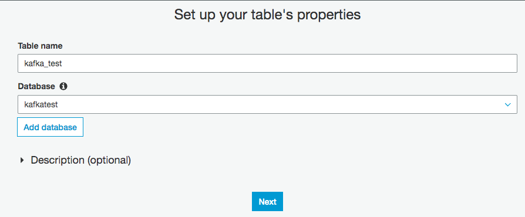
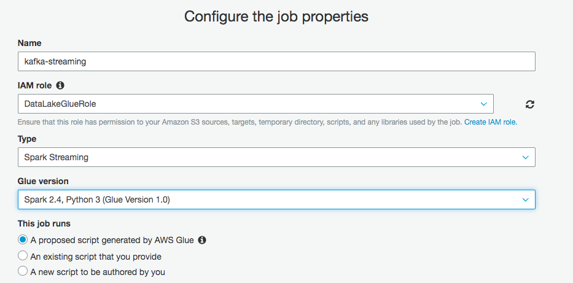
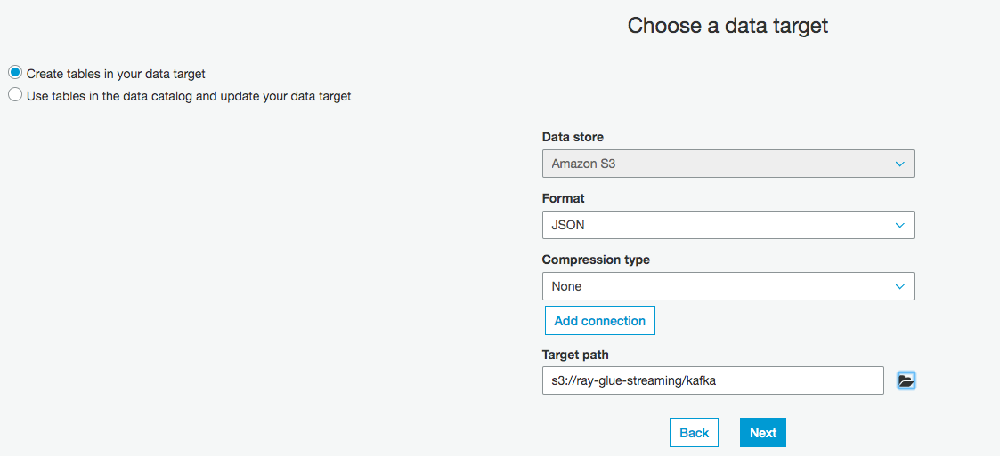
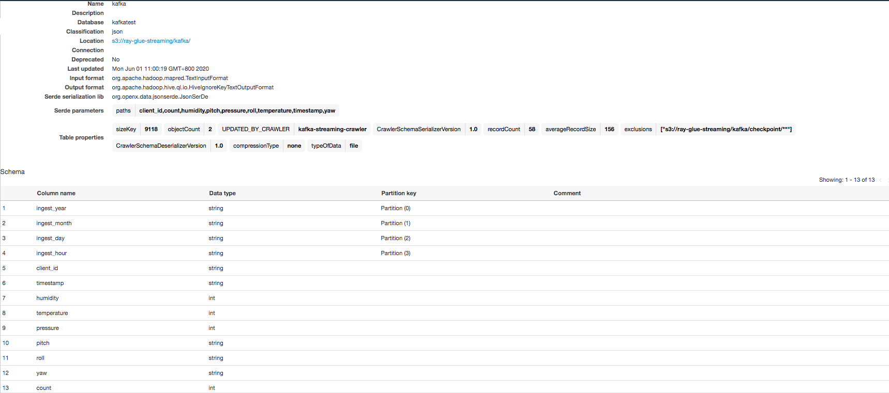

# glue-streaming-kafka-etl-demo

## IoT - Kafka - Glue Streaming - Athena demo

Archiecture



# Create Kafka cluster
1. Security group `kafka-sg` and ingress rule
    - Protocol: TCP Port range: 9092
    - Protocol: TCP Port range: 9094
    - Protocol: TCP Port range: 2181
    - All traffic to `kafka-sg` security group or VPC CIDR range

2. Create Kafka (MSK) cluster on Console
    - Name: MSKWorkshopCluster
    - Apache Kafka version: 2.2.1
    - Configuration Section
      - auto.create.topics.enable - allow topics to be created automatically by producers and consumers. 
      - delete.topic.enable - enables topic deletion on the server. 
      - log.retention.hours - 8 hours for the lab.
    - Select VPC with 3 private subnet and which the same located with glue connector will created later
    - Select kafka.m5.large as the Broker Instance Type and 1 for the number of brokers per AZ
    - 100GiB Storage per Broker
    - Un-check Enable encryption within the cluster
    - Select Both TLS encrypted and plaintext traffic allowed.
    - Select Use AWS managed CMK.
    - Leave Enable TLS client authentication blank.
    - Select Enhanced topic-level monitoring. This let you troubleshoot and understand your traffic better.
    - Select Enable open monitoring with Prometheus
    - Broker log delivery to CloudWatch logs
    - Select Customize Settings, then in the drop down box select the `kafka-sg` security group

3. Optional, create by CLI

- Create configuration 
```bash
aws kafka create-configuration --name "WorkshopMSKConfig" \
--description "Configuration used for MSK workshop - Auto topic creation; topic deletion; 8hrs retention" \
--kafka-versions "2.3.1" --server-properties file://cluster_config.txt

cluster_config.txt

 auto.create.topics.enable = true
 delete.topic.enable = true
 log.retention.hours = 8

```

- clusterinfo.json

```json
{
    "BrokerNodeGroupInfo": {
        "BrokerAZDistribution": "DEFAULT",
        "InstanceType": "kafka.m5.large",
        "ClientSubnets": [
            "subnet-09bbd8a628bc40e07", "subnet-0c9da7354a25eed7e"
        ],
        "SecurityGroups": [
            "sg-0ced57eee818d3811"
        ],
        "StorageInfo": {
            "EbsStorageInfo": {
                "VolumeSize": 100
            }
        }
    },
    "ClusterName": "MSKWorkshopCluster",
    "ConfigurationInfo": {
        "Arn": "arn:aws-cn:kafka:cn-north-1:<accont-id>:configuration/WorkshopMSKConfig/4fbefc4f-dc0b-4174-9bb7-a0b52632b712-4",
        "Revision": 1
    },
    "EncryptionInfo": {
        "EncryptionAtRest": {
            "DataVolumeKMSKeyId": ""
        },
        "EncryptionInTransit": {
            "InCluster": false,
            "ClientBroker": "TLS_PLAINTEXT"
        }
    },
    "EnhancedMonitoring": "PER_TOPIC_PER_BROKER",
    "KafkaVersion": "2.3.1",
    "NumberOfBrokerNodes": 2,
    "OpenMonitoring": {
        "Prometheus": {
            "JmxExporter": {
                "EnabledInBroker": true
            },
            "NodeExporter": {
                "EnabledInBroker": true
            }
        }
    }
}
```

- Create cluster
```bash
aws kafka create-cluster --cli-input-json file://clusterinfo.json

# copy and create vairable for ClusterArn
aws kafka describe-cluster --cluster-arn $ClusterArn | grep -i state
```

# create the Topic and produce data
1. login to EC2 or Cloud9 IDE

2. install client and create topic

```bash
sudo yum install java-1.8.0
wget https://archive.apache.org/dist/kafka/2.2.1/kafka_2.12-2.2.1.tgz
tar -xzf kafka_2.12-2.2.1.tgz
cd kafka_2.12-2.2.1/

ZookeeperConnectString=$(aws kafka describe-cluster --cluster-arn $ClusterArn --region cn-north-1 | jq .ClusterInfo.ZookeeperConnectString | sed 's/"//g' )
echo ${ZookeeperConnectString}

# replacing ZookeeperConnectString with the value that after you ran the describe-cluster command. 
bin/kafka-topics.sh --create --zookeeper $ZookeeperConnectString --replication-factor 2 --partitions 1 --topic AWSKafkaTutorialTopic
```

3. Produce and consume data, verify the data can be produced and consumed correctly
```bash
cp /usr/lib/jvm/java-1.8.0-openjdk-1.8.0.252.b09-2.amzn2.0.1.x86_64/jre/lib/security/cacerts /tmp/kafka.client.truststore.jks
# create client.properties
cat kafka_2.12-2.2.1/config/client.properties
security.protocol=SSL
ssl.truststore.location=/tmp/kafka.client.truststore.jks

BootstrapBrokerString=$(aws kafka get-bootstrap-brokers --region cn-north-1 --cluster-arn $ClusterArn | jq .BootstrapBrokerString | sed 's/"//g' )
echo ${BootstrapBrokerString}

BootstrapBrokerStringTls=$(aws kafka get-bootstrap-brokers --region cn-north-1 --cluster-arn $ClusterArn | jq .BootstrapBrokerStringTls | sed 's/"//g' )
echo ${BootstrapBrokerStringTls}

# Producer
cd kafka_2.12-2.2.1/
bin/kafka-console-producer.sh --broker-list $BootstrapBrokerStringTLS --producer.config config/client.properties --topic AWSKafkaTutorialTopic
OR
bin/kafka-console-producer.sh --broker-list $BootstrapBrokerString --topic AWSKafkaTutorialTopic

# Consumer
bin/kafka-console-consumer.sh --bootstrap-server $BootstrapBrokerStringTLS --consumer.config config/client.properties --topic AWSKafkaTutorialTopic --from-beginning
OR
bin/kafka-console-consumer.sh --bootstrap-server $BootstrapBrokerString --topic AWSKafkaTutorialTopic --from-beginning
```

4. Python producer code
```bash
# Install dependency
pip install -r scripts/requirements.txt

# Run code to send, once per second, a JSON message with sensor data to the `AWSKafkaTutorialTopic` Kafka topic.
cd scripts
python scripts/iot-kafka-producer.py

# Check the consumer terminal can get the message
bin/kafka-console-consumer.sh --bootstrap-server $BootstrapBrokerStringTLS --consumer.config config/client.properties --topic AWSKafkaTutorialTopic --from-beginning
```

# Processing Streaming Data with AWS Glue
1. Create Kafka connection for AWS Glue

- Click “Add connection”, input the Connection Name as `kafkatest`, Connection type for Kafka, Kafka bootstrap server URLs you get it from Kafka cluster `$BootstrapBrokerStringTLS`
- Connection for Kafka by default use the SSL connection, you CAN NOT use the Kafka bootstrap server URLs without TLS

  

- Choose the VPC, Subnet and security group. The security group need open all ingress ports for same security group or VPC CIDR range

  Otherwise the Glue job will failed with error

  ```bash
  JobName:kafka-streaming and JobRunId:jr_1dc5fbc66da7 failed to execute with exception At least one security group must open all ingress ports.
  To limit traffic, the source security group in your inbound rule can be restricted to the same security group
  ```

2. I manually add a table in the Glue Data Catalog.
- Click Database and Add database, to create a new database `kafkatest`.

- Click Tables and Add tables, to add a new table `kafkatest` from Kafka connection with topic `AWSKafkaTutorialTopic`

- Format: json
- Table schema
```json
kafkatest = {
            "client_id": string
            "timestamp": timestamp,
            "humidity": int,
            "temperature": int,
            "pressure": int,
            "pitch": string,
            "roll": string,
            "yaw": string,
            "count": bigint
        }
```        

3. Create Glue Streaming ETL job. 

    Create a new job to ingest data from Kafka, and store the data into S3.

- The IAM role with `AWSGlueServiceRole` and `AmazonMSKReadOnlyAccess` managed policies. 
- Create Glue Streaming job with name `kafka-streaming`
    - Select the type as `Spark Streaming` and Glue version `Spark2.4, Python 3`
	
    - For the data source, select the table `kafkatest` as just created, receiving data from the Kafka stream.
	
    - As target, create a new table in the Glue Data Catalog, using `JSON` format. The JSON files generated by this job are going to be stored in an S3 bucket
	
    - Leave the default mapping that keeps in output all the columns in the source stream. 
	
    - Click Save job and edit scripts, you will see the scripts generated automatically. You can add your processing logic, or update the currently code. If you update the code, please click Save.
	
- Start the job, and after a few minutes, you can see the checkpoint information and the ingested data partitioned. They are partitioned by ingest date (year, month, day, and hour).
	
- Check the cloudwatch logs
 
You will see the job history from below, and you can click the “Logs” or “Error logs” to see the detailed information.

SSL/TLS connection

```bash
consumer.ConsumerConfig (AbstractConfig.java:logAll(180)) - ConsumerConfig values: 
	auto.commit.interval.ms = 5000
	auto.offset.reset = earliest
	bootstrap.servers = [b-1.mskworkshopcluster.8bx5lx.c4.kafka.cn-north-1.amazonaws.com.cn:9094, b-2.mskworkshopcluster.8bx5lx.c4.kafka.cn-north-1.amazonaws.com.cn:9094]
	check.crcs = true
	client.id = 
	connections.max.idle.ms = 540000
	enable.auto.commit = false
	exclude.internal.topics = true
	fetch.max.bytes = 52428800
	fetch.max.wait.ms = 500
	fetch.min.bytes = 1
	group.id = spark-kafka-source-f2d72bad-0e10-4898-949f-fdb6d55e5b49--367204582-driver-0
	heartbeat.interval.ms = 3000
	interceptor.classes = null
	key.deserializer = class org.apache.kafka.common.serialization.ByteArrayDeserializer
	max.partition.fetch.bytes = 1048576
	max.poll.interval.ms = 300000
	max.poll.records = 1
	metadata.max.age.ms = 300000
	metric.reporters = []
	metrics.num.samples = 2
	metrics.sample.window.ms = 30000
	partition.assignment.strategy = [class org.apache.kafka.clients.consumer.RangeAssignor]
	receive.buffer.bytes = 65536
	reconnect.backoff.ms = 50
	request.timeout.ms = 305000
	retry.backoff.ms = 100
	sasl.kerberos.kinit.cmd = /usr/bin/kinit
	sasl.kerberos.min.time.before.relogin = 60000
	sasl.kerberos.service.name = null
	sasl.kerberos.ticket.renew.jitter = 0.05
	sasl.kerberos.ticket.renew.window.factor = 0.8
	sasl.mechanism = GSSAPI
	security.protocol = SSL
	send.buffer.bytes = 131072
	session.timeout.ms = 10000
	ssl.cipher.suites = null
	ssl.enabled.protocols = [TLSv1.2, TLSv1.1, TLSv1]
	ssl.endpoint.identification.algorithm = null
	ssl.key.password = null
	ssl.keymanager.algorithm = SunX509
	ssl.keystore.location = null
	ssl.keystore.password = null
	ssl.keystore.type = JKS
	ssl.protocol = TLS
	ssl.provider = null
	ssl.secure.random.implementation = null
	ssl.trustmanager.algorithm = PKIX
	ssl.truststore.location = ExternalAndAWSTrustStore.jks
	ssl.truststore.password = [hidden]
	ssl.truststore.type = JKS
	value.deserializer = class org.apache.kafka.common.serialization.ByteArrayDeserializer
	
2020-06-01 01:32:54,819 INFO  [stream execution thread for [id = ca3e241b-607b-4c02-9d9f-ec8c2683acc5, runId = 8015748b-4851-4e06-aaf0-0035ae612d5c]] utils.AppInfoParser (AppInfoParser.java:<init>(83)) - Kafka version : 0.10.1.0
2020-06-01 01:32:54,819 INFO  [stream execution thread for [id = ca3e241b-607b-4c02-9d9f-ec8c2683acc5, runId = 8015748b-4851-4e06-aaf0-0035ae612d5c]] utils.AppInfoParser (AppInfoParser.java:<init>(84)) - Kafka commitId : 3402a74efb23d1d4
2020-06-01 01:32:55,042 INFO  [stream execution thread for [id = ca3e241b-607b-4c02-9d9f-ec8c2683acc5, runId = 8015748b-4851-4e06-aaf0-0035ae612d5c]] internals.AbstractCoordinator (AbstractCoordinator.java:onSuccess(555)) - Discovered coordinator b-1.mskworkshopcluster.8bx5lx.c4.kafka.cn-north-1.amazonaws.com.cn:9094 (id: 2147483646 rack: null) for group spark-kafka-source-f2d72bad-0e10-4898-949f-fdb6d55e5b49--367204582-driver-0.
2020-06-01 01:32:55,045 INFO  [stream execution thread for [id = ca3e241b-607b-4c02-9d9f-ec8c2683acc5, runId = 8015748b-4851-4e06-aaf0-0035ae612d5c]] internals.ConsumerCoordinator (ConsumerCoordinator.java:onJoinPrepare(333)) - Revoking previously assigned partitions [] for group spark-kafka-source-f2d72bad-0e10-4898-949f-fdb6d55e5b49--367204582-driver-0
2020-06-01 01:32:55,045 INFO  [stream execution thread for [id = ca3e241b-607b-4c02-9d9f-ec8c2683acc5, runId = 8015748b-4851-4e06-aaf0-0035ae612d5c]] internals.AbstractCoordinator (AbstractCoordinator.java:sendJoinGroupRequest(381)) - (Re-)joining group spark-kafka-source-f2d72bad-0e10-4898-949f-fdb6d55e5b49--367204582-driver-0
2020-06-01 01:32:58,163 INFO  [stream execution thread for [id = ca3e241b-607b-4c02-9d9f-ec8c2683acc5, runId = 8015748b-4851-4e06-aaf0-0035ae612d5c]] internals.AbstractCoordinator (AbstractCoordinator.java:onSuccess(349)) - Successfully joined group spark-kafka-source-f2d72bad-0e10-4898-949f-fdb6d55e5b49--367204582-driver-0 with generation 1
2020-06-01 01:32:58,165 INFO  [stream execution thread for [id = ca3e241b-607b-4c02-9d9f-ec8c2683acc5, runId = 8015748b-4851-4e06-aaf0-0035ae612d5c]] internals.ConsumerCoordinator (ConsumerCoordinator.java:onJoinComplete(225)) - Setting newly assigned partitions [AWSKafkaTutorialTopic-0] for group spark-kafka-source-f2d72bad-0e10-4898-949f-fdb6d55e5b49--367204582-driver-0
2020-06-01 01:32:58,427 INFO  [stream execution thread for [id = ca3e241b-607b-4c02-9d9f-ec8c2683acc5, runId = 8015748b-4851-4e06-aaf0-0035ae612d5c]] Configuration.deprecation (Configuration.java:logDeprecation(1285)) - io.bytes.per.checksum is deprecated. Instead, use dfs.bytes-per-checksum
2020-06-01 01:32:58,488 INFO  [stream execution thread for [id = ca3e241b-607b-4c02-9d9f-ec8c2683acc5, runId = 8015748b-4851-4e06-aaf0-0035ae612d5c]] streaming.CheckpointFileManager (Logging.scala:logInfo(54)) - Writing atomically to s3://ray-glue-streaming/checkpoint/sources/0/0 using temp file s3://ray-glue-streaming/checkpoint/sources/0/.0.b2500a85-0299-433a-b27b-f063be1c99db.tmp
2020-06-01 01:32:58,488 INFO  [stream execution thread for [id = ca3e241b-607b-4c02-9d9f-ec8c2683acc5, runId = 8015748b-4851-4e06-aaf0-0035ae612d5c]] s3n.MultipartUploadOutputStream (MultipartUploadOutputStream.java:close(414)) - close closed:false s3://ray-glue-streaming/checkpoint/sources/0/.0.b2500a85-0299-433a-b27b-f063be1c99db.tmp
2020-06-01 01:32:58,617 INFO  [stream execution thread for [id = ca3e241b-607b-4c02-9d9f-ec8c2683acc5, runId = 8015748b-4851-4e06-aaf0-0035ae612d5c]] s3n.S3NativeFileSystem (S3NativeFileSystem.java:rename(1233)) - rename s3://ray-glue-streaming/checkpoint/sources/0/.0.b2500a85-0299-433a-b27b-f063be1c99db.tmp s3://ray-glue-streaming/checkpoint/sources/0/0
2020-06-01 01:32:58,718 INFO  [stream execution thread for [id = ca3e241b-607b-4c02-9d9f-ec8c2683acc5, runId = 8015748b-4851-4e06-aaf0-0035ae612d5c]] streaming.CheckpointFileManager (Logging.scala:logInfo(54)) - Renamed temp file s3://ray-glue-streaming/checkpoint/sources/0/.0.b2500a85-0299-433a-b27b-f063be1c99db.tmp to s3://ray-glue-streaming/checkpoint/sources/0/0
2020-06-01 01:32:58,718 INFO  [stream execution thread for [id = ca3e241b-607b-4c02-9d9f-ec8c2683acc5, runId = 8015748b-4851-4e06-aaf0-0035ae612d5c]] kafka010.KafkaMicroBatchReader (Logging.scala:logInfo(54)) - Initial offsets: 
{
    "AWSKafkaTutorialTopic": {
        "0": 0
    }
}
	
```

3. Configure Crawler `kafka-streaming-crawler` to populate the Glue Data Catalog with target S3 tables `iot_sensor_kinesis`

In the crawler configuration, exclude the `checkpoint/**` folder used by Glue to keep track of the data that has been processed. 


After the crawler execution complete, you can check the table schema.  They are partitioned by ingest date (year, month, day, and hour)



# Query the data from Athena
```bash
SELECT * FROM "kafkatest"."kafka" limit 50;

Select count(*) from "kafkatest"."kafka";
```


# Troubleshooting:

If you use the kafka non SSL/TLS connection, below error will be reported for Glue Streaming ETL job in cloudwatch logs

```bash
2020-06-01 01:50:48,574 INFO  [stream execution thread for [id = ca3e241b-607b-4c02-9d9f-ec8c2683acc5, runId = 0bfde56c-ea92-49af-beb7-0a2e4514594f]] consumer.ConsumerConfig (AbstractConfig.java:logAll(180)) - ConsumerConfig values: 
	auto.commit.interval.ms = 5000
	auto.offset.reset = earliest
	bootstrap.servers = [b-2.mskworkshopcluster.8bx5lx.c4.kafka.cn-north-1.amazonaws.com.cn:9092, b-1.mskworkshopcluster.8bx5lx.c4.kafka.cn-north-1.amazonaws.com.cn:9092]
	check.crcs = true
	client.id = consumer-1
	connections.max.idle.ms = 540000
	enable.auto.commit = false
	exclude.internal.topics = true
	fetch.max.bytes = 52428800
	fetch.max.wait.ms = 500
	fetch.min.bytes = 1
	group.id = spark-kafka-source-aec0dde5-b19c-4f1d-8038-03a9ee0db20a--367204582-driver-0
	heartbeat.interval.ms = 3000
	interceptor.classes = null
	key.deserializer = class org.apache.kafka.common.serialization.ByteArrayDeserializer
	max.partition.fetch.bytes = 1048576
	max.poll.interval.ms = 300000
	max.poll.records = 1
	metadata.max.age.ms = 300000
	metric.reporters = []
	metrics.num.samples = 2
	metrics.sample.window.ms = 30000
	partition.assignment.strategy = [class org.apache.kafka.clients.consumer.RangeAssignor]
	receive.buffer.bytes = 65536
	reconnect.backoff.ms = 50
	request.timeout.ms = 305000
	retry.backoff.ms = 100
	sasl.kerberos.kinit.cmd = /usr/bin/kinit
	sasl.kerberos.min.time.before.relogin = 60000
	sasl.kerberos.service.name = null
	sasl.kerberos.ticket.renew.jitter = 0.05
	sasl.kerberos.ticket.renew.window.factor = 0.8
	sasl.mechanism = GSSAPI
	security.protocol = SSL
	send.buffer.bytes = 131072
	session.timeout.ms = 10000
	ssl.cipher.suites = null
	ssl.enabled.protocols = [TLSv1.2, TLSv1.1, TLSv1]
	ssl.endpoint.identification.algorithm = null
	ssl.key.password = null
	ssl.keymanager.algorithm = SunX509
	ssl.keystore.location = null
	ssl.keystore.password = null
	ssl.keystore.type = JKS
	ssl.protocol = TLS
	ssl.provider = null
	ssl.secure.random.implementation = null
	ssl.trustmanager.algorithm = PKIX
	ssl.truststore.location = ExternalAndAWSTrustStore.jks
	ssl.truststore.password = [hidden]
	ssl.truststore.type = JKS
	value.deserializer = class org.apache.kafka.common.serialization.ByteArrayDeserializer


2020-06-01 01:50:48,701 WARN  [stream execution thread for [id = ca3e241b-607b-4c02-9d9f-ec8c2683acc5, runId = 0bfde56c-ea92-49af-beb7-0a2e4514594f]] network.SslTransportLayer (SslTransportLayer.java:close(166)) - Failed to send SSL Close message 
java.io.IOException: Broken pipe
	at sun.nio.ch.FileDispatcherImpl.write0(Native Method)
	at sun.nio.ch.SocketDispatcher.write(SocketDispatcher.java:47)
	at sun.nio.ch.IOUtil.writeFromNativeBuffer(IOUtil.java:93)
	at sun.nio.ch.IOUtil.write(IOUtil.java:65)
	at sun.nio.ch.SocketChannelImpl.write(SocketChannelImpl.java:468)
	at org.apache.kafka.common.network.SslTransportLayer.flush(SslTransportLayer.java:195)
	at org.apache.kafka.common.network.SslTransportLayer.close(SslTransportLayer.java:163)
	at org.apache.kafka.common.utils.Utils.closeAll(Utils.java:690)
	at org.apache.kafka.common.network.KafkaChannel.close(KafkaChannel.java:47)
	at org.apache.kafka.common.network.Selector.close(Selector.java:487)
	at org.apache.kafka.common.network.Selector.pollSelectionKeys(Selector.java:368)
	at org.apache.kafka.common.network.Selector.poll(Selector.java:291)
	at org.apache.kafka.clients.NetworkClient.poll(NetworkClient.java:260)
	at org.apache.kafka.clients.consumer.internals.ConsumerNetworkClient.poll(ConsumerNetworkClient.java:232)
	at org.apache.kafka.clients.consumer.internals.ConsumerNetworkClient.poll(ConsumerNetworkClient.java:180)
	at org.apache.kafka.clients.consumer.internals.AbstractCoordinator.ensureCoordinatorReady(AbstractCoordinator.java:193)
	at org.apache.kafka.clients.consumer.internals.ConsumerCoordinator.poll(ConsumerCoordinator.java:248)
	at org.apache.kafka.clients.consumer.KafkaConsumer.pollOnce(KafkaConsumer.java:1013)
	at org.apache.kafka.clients.consumer.KafkaConsumer.poll(KafkaConsumer.java:979)
	at org.apache.spark.sql.kafka010.KafkaOffsetReader$$anonfun$fetchLatestOffsets$1$$anonfun$apply$11.apply(KafkaOffsetReader.scala:217)
	at org.apache.spark.sql.kafka010.KafkaOffsetReader$$anonfun$fetchLatestOffsets$1$$anonfun$apply$11.apply(KafkaOffsetReader.scala:215)
	at org.apache.spark.sql.kafka010.KafkaOffsetReader$$anonfun$org$apache$spark$sql$kafka010$KafkaOffsetReader$$withRetriesWithoutInterrupt$1.apply$mcV$sp(KafkaOffsetReader.scala:358)
	at org.apache.spark.sql.kafka010.KafkaOffsetReader$$anonfun$org$apache$spark$sql$kafka010$KafkaOffsetReader$$withRetriesWithoutInterrupt$1.apply(KafkaOffsetReader.scala:357)
	at org.apache.spark.sql.kafka010.KafkaOffsetReader$$anonfun$org$apache$spark$sql$kafka010$KafkaOffsetReader$$withRetriesWithoutInterrupt$1.apply(KafkaOffsetReader.scala:357)
	at org.apache.spark.util.UninterruptibleThread.runUninterruptibly(UninterruptibleThread.scala:77)
	at org.apache.spark.sql.kafka010.KafkaOffsetReader.org$apache$spark$sql$kafka010$KafkaOffsetReader$$withRetriesWithoutInterrupt(KafkaOffsetReader.scala:356)
	at org.apache.spark.sql.kafka010.KafkaOffsetReader$$anonfun$fetchLatestOffsets$1.apply(KafkaOffsetReader.scala:215)
	at org.apache.spark.sql.kafka010.KafkaOffsetReader$$anonfun$fetchLatestOffsets$1.apply(KafkaOffsetReader.scala:215)
	at org.apache.spark.sql.kafka010.KafkaOffsetReader.runUninterruptibly(KafkaOffsetReader.scala:325)
	at org.apache.spark.sql.kafka010.KafkaOffsetReader.fetchLatestOffsets(KafkaOffsetReader.scala:214)
	at org.apache.spark.sql.kafka010.KafkaMicroBatchReader$$anonfun$setOffsetRange$4.apply(KafkaMicroBatchReader.scala:97)
	at org.apache.spark.sql.kafka010.KafkaMicroBatchReader$$anonfun$setOffsetRange$4.apply(KafkaMicroBatchReader.scala:95)
	at scala.Option.getOrElse(Option.scala:121)
	at org.apache.spark.sql.kafka010.KafkaMicroBatchReader.setOffsetRange(KafkaMicroBatchReader.scala:95)
	at org.apache.spark.sql.execution.streaming.MicroBatchExecution$$anonfun$org$apache$spark$sql$execution$streaming$MicroBatchExecution$$constructNextBatch$1$$anonfun$5$$anonfun$apply$2.apply$mcV$sp(MicroBatchExecution.scala:353)
	at org.apache.spark.sql.execution.streaming.MicroBatchExecution$$anonfun$org$apache$spark$sql$execution$streaming$MicroBatchExecution$$constructNextBatch$1$$anonfun$5$$anonfun$apply$2.apply(MicroBatchExecution.scala:353)
	at org.apache.spark.sql.execution.streaming.MicroBatchExecution$$anonfun$org$apache$spark$sql$execution$streaming$MicroBatchExecution$$constructNextBatch$1$$anonfun$5$$anonfun$apply$2.apply(MicroBatchExecution.scala:353)
	at org.apache.spark.sql.execution.streaming.ProgressReporter$class.reportTimeTaken(ProgressReporter.scala:351)
	at org.apache.spark.sql.execution.streaming.StreamExecution.reportTimeTaken(StreamExecution.scala:58)
	at org.apache.spark.sql.execution.streaming.MicroBatchExecution$$anonfun$org$apache$spark$sql$execution$streaming$MicroBatchExecution$$constructNextBatch$1$$anonfun$5.apply(MicroBatchExecution.scala:349)
	at org.apache.spark.sql.execution.streaming.MicroBatchExecution$$anonfun$org$apache$spark$sql$execution$streaming$MicroBatchExecution$$constructNextBatch$1$$anonfun$5.apply(MicroBatchExecution.scala:341)
	at scala.collection.TraversableLike$$anonfun$map$1.apply(TraversableLike.scala:234)
	at scala.collection.TraversableLike$$anonfun$map$1.apply(TraversableLike.scala:234)
	at scala.collection.mutable.ResizableArray$class.foreach(ResizableArray.scala:59)
	at scala.collection.mutable.ArrayBuffer.foreach(ArrayBuffer.scala:48)
	at scala.collection.TraversableLike$class.map(TraversableLike.scala:234)
	at scala.collection.AbstractTraversable.map(Traversable.scala:104)
	at org.apache.spark.sql.execution.streaming.MicroBatchExecution$$anonfun$org$apache$spark$sql$execution$streaming$MicroBatchExecution$$constructNextBatch$1.apply$mcZ$sp(MicroBatchExecution.scala:341)
	at org.apache.spark.sql.execution.streaming.MicroBatchExecution$$anonfun$org$apache$spark$sql$execution$streaming$MicroBatchExecution$$constructNextBatch$1.apply(MicroBatchExecution.scala:337)
	at org.apache.spark.sql.execution.streaming.MicroBatchExecution$$anonfun$org$apache$spark$sql$execution$streaming$MicroBatchExecution$$constructNextBatch$1.apply(MicroBatchExecution.scala:337)
	at org.apache.spark.sql.execution.streaming.MicroBatchExecution.withProgressLocked(MicroBatchExecution.scala:557)
	at org.apache.spark.sql.execution.streaming.MicroBatchExecution.org$apache$spark$sql$execution$streaming$MicroBatchExecution$$constructNextBatch(MicroBatchExecution.scala:337)
	at org.apache.spark.sql.execution.streaming.MicroBatchExecution$$anonfun$runActivatedStream$1$$anonfun$apply$mcZ$sp$1.apply$mcV$sp(MicroBatchExecution.scala:183)
	at org.apache.spark.sql.execution.streaming.MicroBatchExecution$$anonfun$runActivatedStream$1$$anonfun$apply$mcZ$sp$1.apply(MicroBatchExecution.scala:166)
	at org.apache.spark.sql.execution.streaming.MicroBatchExecution$$anonfun$runActivatedStream$1$$anonfun$apply$mcZ$sp$1.apply(MicroBatchExecution.scala:166)
	at org.apache.spark.sql.execution.streaming.ProgressReporter$class.reportTimeTaken(ProgressReporter.scala:351)
	at org.apache.spark.sql.execution.streaming.StreamExecution.reportTimeTaken(StreamExecution.scala:58)
	at org.apache.spark.sql.execution.streaming.MicroBatchExecution$$anonfun$runActivatedStream$1.apply$mcZ$sp(MicroBatchExecution.scala:166)
	at org.apache.spark.sql.execution.streaming.ProcessingTimeExecutor.execute(TriggerExecutor.scala:56)
	at org.apache.spark.sql.execution.streaming.MicroBatchExecution.runActivatedStream(MicroBatchExecution.scala:160)
	at org.apache.spark.sql.execution.streaming.StreamExecution.org$apache$spark$sql$execution$streaming$StreamExecution$$runStream(StreamExecution.scala:281)
	at org.apache.spark.sql.execution.streaming.StreamExecution$$anon$1.run(StreamExecution.scala:193)
```