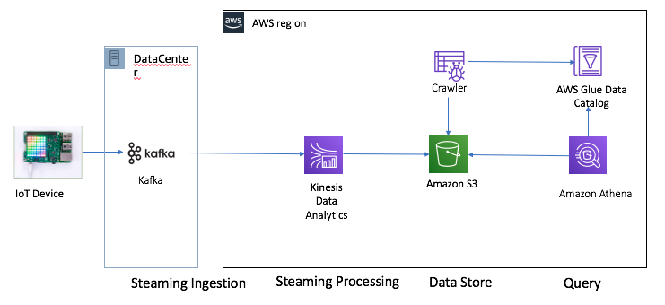

# Kafka - Kinesis Data Analytics - demo

## IoT - Kafka - Kinesis Data Analytics - Athena demo Archiecture



## Create Kafka (MSK) cluster on Console
    - Name: MSKWorkshopCluster
    - Apache Kafka version: 2.2.1
    - Configuration Section
      - auto.create.topics.enable - allow topics to be created automatically by producers and consumers. 
      - delete.topic.enable - enables topic deletion on the server. 
      - log.retention.hours - 8 hours for the lab.
    - Select VPC with 3 private subnet and which the same located with glue connector will created later
    - Select kafka.m5.large as the Broker Instance Type and 1 for the number of brokers per AZ
    - 100GiB Storage per Broker
    - Un-check Enable encryption within the cluster
    - Select Both TLS encrypted and plaintext traffic allowed.
    - Select Use AWS managed CMK.
    - Leave Enable TLS client authentication blank.
    - Select Enhanced topic-level monitoring. This let you troubleshoot and understand your traffic better.
    - Select Enable open monitoring with Prometheus
    - Broker log delivery to CloudWatch logs
    - Select Customize Settings, then in the drop down box select the `kafka-sg` security group

## create the Topic and produce data
1. login to EC2 or Cloud9 IDE

2. install client and create topic

```bash
sudo yum install java-1.8.0
wget https://archive.apache.org/dist/kafka/2.2.1/kafka_2.12-2.2.1.tgz
tar -xzf kafka_2.12-2.2.1.tgz
cd kafka_2.12-2.2.1/

ClusterArn=
ZookeeperConnectString=$(aws kafka describe-cluster --cluster-arn $ClusterArn --region cn-northwest-1 | jq .ClusterInfo.ZookeeperConnectString | sed 's/"//g' )
echo ${ZookeeperConnectString}

# replacing ZookeeperConnectString with the value that after you ran the describe-cluster command. 
bin/kafka-topics.sh --create --zookeeper $ZookeeperConnectString --replication-factor 3 --partitions 1 --topic AWSKafkaTutorialTopic

bin/kafka-topics.sh --create --zookeeper $ZookeeperConnectString --replication-factor 3 --partitions 1 --topic AWSKafkaTutorialTopicDestination
```

3. get bootstrap servers
```bash
BootstrapBrokerString=$(aws kafka get-bootstrap-brokers --region cn-northwest-1 --cluster-arn $ClusterArn | jq .BootstrapBrokerString | sed 's/"//g' )
echo ${BootstrapBrokerString}

BootstrapBrokerStringTls=$(aws kafka get-bootstrap-brokers --region cn-northwest-1 --cluster-arn $ClusterArn | jq .BootstrapBrokerStringTls | sed 's/"//g' )
echo ${BootstrapBrokerStringTls}
```

## Create the Application Code
1. Install maven
```bash
sudo amazon-linux-extras enable corretto8
sudo yum install -y java-1.8.0-amazon-corretto-devel
wget http://ftp.meisei-u.ac.jp/mirror/apache/dist/maven/maven-3/3.6.3/binaries/apache-maven-3.6.3-bin.tar.gz
tar -zxf apache-maven-3.6.3-bin.tar.gz
export JAVA_HOME="/usr/lib/jvm/java-1.8.0-amazon-corretto.x86_64"
PATH=$JAVA_HOME/bin:$PATH
export PATH=/home/ec2-user/apache-maven-3.6.3/bin:$PATH
```

2. Compile the Application Code 
```bash
git clone https://github.com/aws-samples/amazon-kinesis-data-analytics-java-examples
cd amazon-kinesis-data-analytics-java-examples/KafkaConnectors
mvn package -Dflink.version=1.8.2

# The output jar
target/KafkaGettingStartedJob-1.0.jar
```

3. Upload the Apache Flink Streaming Java Code

```bash
aws s3 cp target/KafkaGettingStartedJob-1.0.jar s3://kda-app-code-ruiliang/kafka/KafkaGettingStartedJob-1.0.jar
```

## Create the Application
1. On the Kinesis Analytics - Create application page, provide the application details as follows:
- For Application name, enter MyKafkaApplication.
- For Access permissions, choose Create / update IAM role kinesis-analytics-MyKafkaApplication-cn-northwest-1

2. Configure the Application
- set the code location: Amazon S3 bucket: kda-app-code-ruiliang, Path to Amazon S3 object: kafka/KafkaGettingStartedJob-1.0.jar
- Under Properties, choose Add Group. Create a property group named KafkaSource with the following properties:

Non SSL/TLS bootstrap

| Key | Value |
| --- | --- |
| topic | AWSKafkaTutorialTopic |
| bootstrap.servers | The bootstrap server list you saved previously |

SSL/TLS bootstrap

| Key | Value |
| --- | --- |
| topic | AWSKafkaTutorialTopic |
| bootstrap.servers | The bootstrap server tls list you saved previously |
| security.protocol | SSL |
| ssl.truststore.location | /usr/local/openjdk-8/jre/lib/security/cacerts |
| ssl.truststore.password | changeit |

- Create a other property group named KafkaSink with the following properties:

Non SSL/TLS bootstrap

| Key | Value |
| --- | --- |
| topic | AWSKafkaTutorialTopicDestination |
| bootstrap.servers | The bootstrap server list you saved previously |

Non SSL/TLS bootstrap

| Key | Value |
| --- | --- |
| topic | AWSKafkaTutorialTopicDestination |
| bootstrap.servers | The bootstrap server tls list you saved previously |
| security.protocol | SSL |
| ssl.truststore.location | /usr/local/openjdk-8/jre/lib/security/cacerts |
| ssl.truststore.password | changeit |

- Under Snapshots, choose Disable. This will make it easier to update the application without loading invalid application state data. 

- Under Monitoring, ensure that the Monitoring metrics level is set to Application. 

- For CloudWatch logging, choose the Enable check box. 

- VPC setting, set the MSK VPC configuration or your custom VPC configuration

## Run the application and test the application
```bash
# Producer
cd kafka_2.12-2.2.1/
bin/kafka-console-producer.sh --broker-list $BootstrapBrokerStringTls --producer.config config/client.properties --topic AWSKafkaTutorialTopic
OR
bin/kafka-console-producer.sh --broker-list $BootstrapBrokerString --topic AWSKafkaTutorialTopic
# Enter any message that you want, and press Enter. Repeat this step two or three times. Every time you enter a line and press Enter, that line is sent to your Apache Kafka cluster as a separate message. 
>hello kafka
>I am in the testing
>can you hear me 

OR 
cd scripts
python scripts/iot-kafka-producer.py

Publishing message to topic 'streaming-data': {'client_id': 'raspberrypi', 'timestamp': '2020-07-14 03:22:22', 'humidity': 50, 'temperature': 43, 'pressure': 1301, 'pitch': 'sample', 'roll': 'demo', 'yaw': 'test', 'count': 0}
Publishing message to topic 'streaming-data': {'client_id': 'raspberrypi', 'timestamp': '2020-07-14 03:22:23', 'humidity': 36, 'temperature': 1, 'pressure': 875, 'pitch': 'sample', 'roll': 'demo', 'yaw': 'test', 'count': 1}
Publishing message to topic 'streaming-data': {'client_id': 'raspberrypi', 'timestamp': '2020-07-14 03:22:24', 'humidity': 80, 'temperature': 40, 'pressure': 1293, 'pitch': 'sample', 'roll': 'demo', 'yaw': 'test', 'count': 2}

# Consumer of KafkaSink
bin/kafka-console-consumer.sh --bootstrap-server $BootstrapBrokerStringTls --consumer.config config/client.properties --topic AWSKafkaTutorialTopicDestination --from-beginning
OR
bin/kafka-console-consumer.sh --bootstrap-server $BootstrapBrokerString --topic AWSKafkaTutorialTopicDestination --from-beginning
# Check you can receive the massage you entered
hello kafka
I am in the testing
can you hear me
{"client_id": "raspberrypi", "timestamp": "2020-07-14 03:22:22", "humidity": 50, "temperature": 43, "pressure": 1301, "pitch": "sample", "roll": "demo", "yaw": "test", "count": 0}
{"client_id": "raspberrypi", "timestamp": "2020-07-14 03:22:23", "humidity": 36, "temperature": 1, "pressure": 875, "pitch": "sample", "roll": "demo", "yaw": "test", "count": 1}
{"client_id": "raspberrypi", "timestamp": "2020-07-14 03:22:24", "humidity": 80, "temperature": 40, "pressure": 1293, "pitch": "sample", "roll": "demo", "yaw": "test", "count": 2}
```

## Clean up

- Delete Your Kinesis Data Analytics Application
- Delete Your Kafka Cluster
- Delete Your IAM Resources
- Delete Your CloudWatch Resources

## Reference
[Flink Apache Kafka Connector](https://ci.apache.org/projects/flink/flink-docs-stable/dev/connectors/kafka.html)