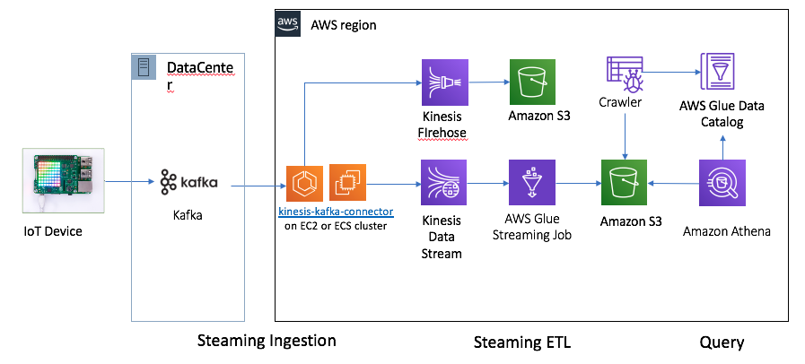

# Kafka-Kinesis-Connector

The Kafka-Kinesis-Connector is a connector to be used with Kafka Connect to publish messages from Kafka to Amazon Kinesis Streams or Amazon Kinesis Firehose.

Kafka-Kinesis-Connector for Firehose is used to publish messages from Kafka to one of the following destinations: Amazon S3, Amazon Redshift, or Amazon Elasticsearch Service and in turn enabling near real time analytics.

Kafka-Kinesis-Connector for Kinesis is used to publish messages from Kafka to Amazon Kinesis Streams and in turn enabling real time analytics by using analytics services.

Kafka-Kinesis-Connector can be executed on on-premise nodes or EC2 machines. It can be executed in standalone mode as well as distributed mode.

The [github repository for China region](https://github.com/JoeShi/kinesis-kafka-connector/tree/cn-region-support)

Archiecture for kinesis-kafka-connector



# Kinesis Demo Step
1. Create Kafka (MSK) cluster `MSKWorkshopCluster`


2. Create Kinesis Data Steam `iot-data-stream` with 1 shard

3. Clone the project to one EC2
```bash
git clone https://github.com/JoeShi/kinesis-kafka-connector.git
git checkout cn-region-support
``` 

4. Building the project
```bash
sudo amazon-linux-extras enable corretto8
sudo yum install java-1.8.0-amazon-corretto-devel
wget http://ftp.meisei-u.ac.jp/mirror/apache/dist/maven/maven-3/3.6.3/binaries/apache-maven-3.6.3-bin.tar.gz
tar -zxf apache-maven-3.6.3-bin.tar.gz
export JAVA_HOME="/usr/lib/jvm/java-1.8.0-amazon-corretto.x86_64"
PATH=$JAVA_HOME/bin:$PATH
export PATH=/home/ec2-user/apache-maven-3.6.3/bin:$PATH

cd kinesis-kafka-connector
# update the pom.xml
# <dependency>
#                     <groupId>org.slf4j</groupId>
#                     <artifactId>slf4j-api</artifactId>
#                     <version>1.7.25</version>
#                     <scope>test</scope>
#                 </dependency>
#                 <dependency>
#                     <groupId>org.slf4j</groupId>
#                     <artifactId>slf4j-log4j12</artifactId>
#                     <version>1.7.25</version>
#                     <scope>test</scope>
#                 </dependency>
#                 <dependency>
#                      <groupId>com.google.guava</groupId>
#                      <artifactId>guava</artifactId>
#                      <version>20.0</version>
#                      <scope>test</scope>
#             </dependency>
mvn package

# THe output is amazon-kinesis-kafka-connector-X.X.X.jar
```

5. Set up connector properties `kafka-kinesis-streams-connector.properties`

6. Set up worker properties `worker.properties` for distributed/standalone mode
```bash
plugin.path=/home/ec2-user/kafka_2.12-2.2.1/libs,/home/ec2-user/iot-kafka/kinesis-kafka-connector/target
```

7. Copy artifact amazon-kinesis-kafka-connector-0.0.X.jar to `plugin.path=/home/ec2-user/kafka_2.12-2.2.1/libs`

8. Running a Connector
```bash
wget https://archive.apache.org/dist/kafka/2.2.1/kafka_2.12-2.2.1.tgz
tar -xzf kafka_2.12-2.2.1.tgz
cd kafka_2.12-2.2.1/

# Make sure you have set correct credential in aws configure
./bin/connect-standalone.sh /home/ec2-user/iot-kafka/kinesis-kafka-connector/config/worker.properties /home/ec2-user/iot-kafka/kinesis-kafka-connector/config/kinesis-streams-kafka-connector.properties
```

9. Check the stream
```bash
# Generate the kafka data
python iot-kafka-producer.py
```

Optional:

You can install [Confluent Platform](https://docs.confluent.io/current/installation/installing_cp/zip-tar.html#get-the-software) to replace the apache kafka package

```bash
# Download confluent-community-platform
curl -O http://packages.confluent.io/archive/5.5/confluent-community-5.5.0-2.12.zip
unzip confluent-5.5.0-2.12.zip
cd confluent-5.5.0

# Download https://docs.confluent.io/current/connect/managing/confluent-hub/client.html
unzip confluent-hub-client-latest.tar.gz
Add confluent-hub-client/bin directory to your PATH environment

# Install the kafka-connect-datagen to generate dummy data
confluent-hub install confluentinc/kafka-connect-datagen:latest

# copy the kinesis-kafka-connector to Confluent
cp kinesis-kafka-connector/target/amazon-kinesis-kafka-connector-0.0.X.jar $CONFLUENT_HOME/share/java/kafka/

# use the Kafka-connect-datagen to generate data
# Make sure you have set correct credential in aws configure
./bin/connect-standalone worker_datagen.properties orders.properties

# Use the Kinesis-kafka-connector to write kafka data to kinesis stream
# Make sure you have set correct credential in aws configure
./bin/connect-standalone /home/ec2-user/iot-kafka/kinesis-kafka-connector/config/worker.properties /home/ec2-user/iot-kafka/kinesis-kafka-connector/config/kinesis-streams-kafka-connector.properties
```

10. Check the stream
```bash
aws kinesis list-shards --stream-name iot-data-stream --region cn-north-1
SHARD_ITERATOR=$(aws kinesis get-shard-iterator --shard-id shardId-000000000000 --shard-iterator-type LATEST --stream-name iot-data-stream --query 'ShardIterator' --region cn-north-1)
aws kinesis get-records --limit 10 --shard-iterator $SHARD_ITERATOR --region cn-north-1
```

10. Create Glue Streaming ETL job. 

- The IAM role with `AWSGlueServiceRole` and `AmazonKinesisReadOnlyAccess` managed policies. 
- Create the table
```json
kafka_kinesis = {
            "client_id": string, partition
            "timestamp": timestamp,
            "humidity": int,
            "temperature": int,
            "pressure": int,
            "pitch": string,
            "roll": string,
            "yaw": string,
            "count": bigint
        }
```   
- Create Glue Streaming job with name `kafka-kinesis-streaming-job`, 
    - Select the type as `Spark Streaming` 
    - For the data source, select the table `kafka_kinesis` as just created, receiving data from the Kinesis stream.
    - As target, create a new table in the Glue Data Catalog, using `JSON` format and Store in S3
    - Leave the default mapping that keeps in output all the columns in the source stream. 
    - Start the job, and after a few minutes, check the files containing the output of the job appearing in the output S3 bucket. They are partitioned by ingest date (year, month, day, and hour).

11. Query the data from Athena


# Kinesis Firehose demo
1. Create Kinesis Firehose `iot-firehose-stream`

2. Set up connector properties `kinesis-firehose-kafka-connector.properties`

3. Running a Connector
```
./bin/connect-standalone.sh /home/ec2-user/iot-kafka/kinesis-kafka-connector/config/worker.properties /home/ec2-user/iot-kafka/kinesis-kafka-connector/config/kinesis-firehose-kafka-connector.properties
```

4. Check the S3 bucket the data has been created


5. Query the data from Athena


# Reference
[kinesis-kafka-connector example](https://github.com/JoeShi/kafka-realtime-data-processing#kinesis-kafka-connector-%E5%AE%9E%E4%BE%8B)