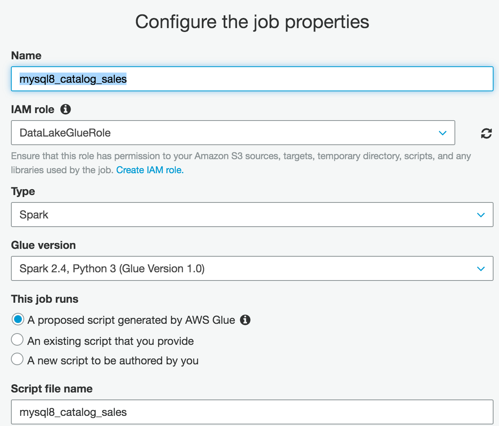
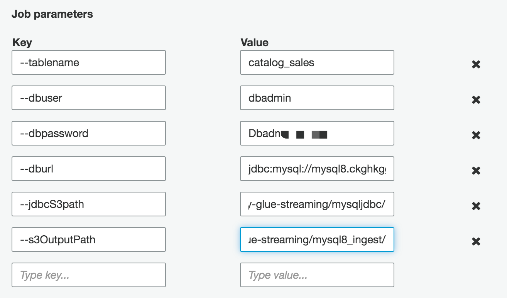
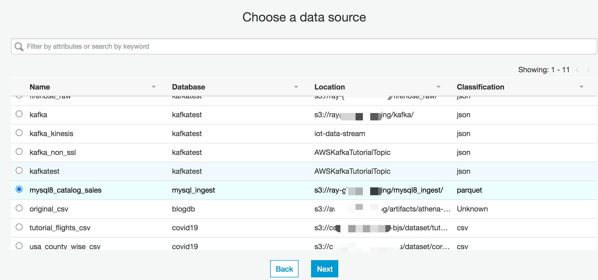
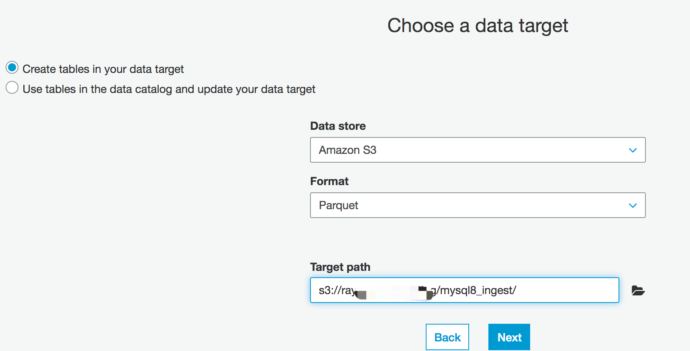
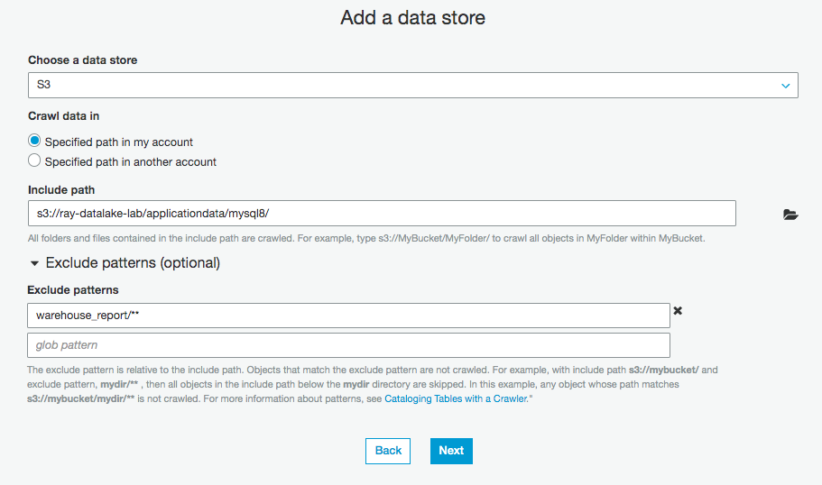
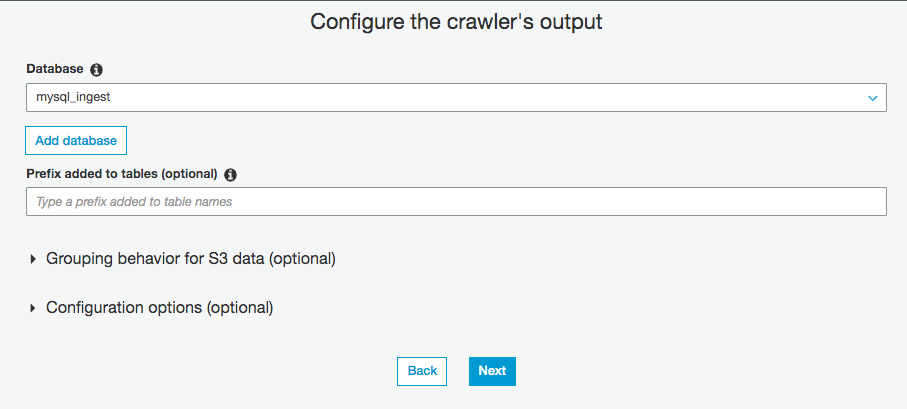
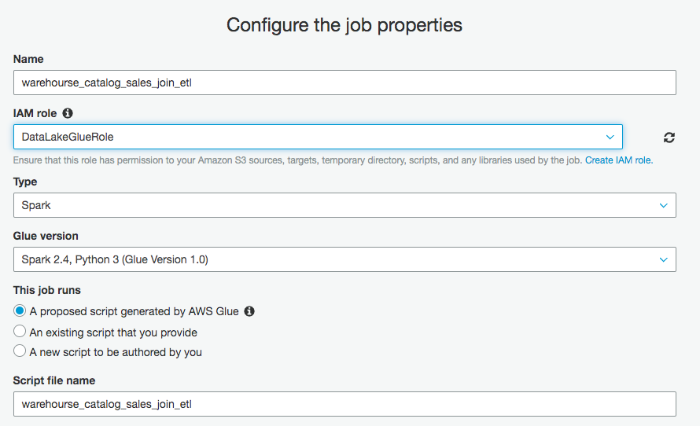

# Glue ingest MySQL8.0 via Glue connector

## Prepare the RDS MySQL connection
MySQL 8.0.17

1. Connect the Mysql and load sample data
```bash

mysql -h $mysqlhost -u dbadmin -p
MySQL [(none)]> source warehouse-catelog_sales.sql
MySQL [testdb]> SELECT * FROM catalog_sales LIMIT 10;
MySQL [testdb]> SELECT * FROM warehouse  LIMIT 10;

# The w_warehouse_sk and cs_warehouse_sk in these two tables can be related for subsequent data processing join.
```

2. Add a JDBC connection `rds-mysql8.0`
```bash
#JDBC URL
jdbc:mysql://$mysqlhost:3306/testdb

# Security group
3306 port
```
For security group and VPC setting, please check [Setting Up a VPC to Connect to JDBC Data Stores](https://docs.aws.amazon.com/glue/latest/dg/setup-vpc-for-glue-access.html)

[Glue Connection Properties details](https://docs.aws.amazon.com/glue/latest/dg/connection-defining.html#connection-properties-jdbc)


3. Test the JDBC connection

**Do not test the connection after creating a successful connection, because Glue's default MySQL JDBC driver does not support MySQL8.0**

**But we can use specify the MySQL8.0 JDBC in ETL Job**. [Bring your own JDBC drivers to your Glue Spark ETL jobs](https://aws.amazon.com/about-aws/whats-new/2019/11/aws-glue-now-enables-you-to-bring-your-own-jdbc-drivers-to-your-glue-spark-etl-jobs/)


4. Create Glue sample database `mysql_ingest`

5. Create the dummy table (Use for dummy datasource in ETL job)

## An AWS Glue ETL job read 2 tables from an RDS MySQL8.0 database and join 2 tables

1. Due to the Glue's default MySQL JDBC driver does not support MySQL8.0, you can not set up the crawler point to the MySQL tables to build the table metadata in the AWS Glue Data Catalog as a data source. We will directly edit the ETL job.

2. Create the ETL job `mysql8_catalog_sales`



Add the Job Parameters

```json
{
    "--tablename":"catalog_sales",
    "--dbuser": "dbadmin",
    "--dbpassword": "YOUR_PASSWORD",
    "--dburl":"jdbc:mysql://$mysqlhost:3306/testdb",
    "--jdbcS3path":"s3://xxxx/mysqljdbc/",
    "--s3OutputPath":"s3://xxx/mysql8_ingest/"
}
```



2. Download the mysql-connector-java-8.0.17.jar，upload to jdbcS3path specified S3 path





3. Edit the ETL job script
[glue-etl-connect-paramters and sample etl script](https://docs.aws.amazon.com/glue/latest/dg/aws-glue-programming-etl-connect.html)

Sample [catalog_sales_etl.py](scripts/catalog_sales_etl.py)

**Important: Make sure you select the connection `mysql8.0` you created**


4. Create the similar ETL job `mysql8_warehouse`

Add the Job Parameters

```json
{
    "--tablename":"warehouse",
    "--dbuser": "dbadmin",
    "--dbpassword": "YOUR_PASSWORD",
    "--dburl":"jdbc:mysql://$mysqlhost:3306/testdb",
    "--jdbcS3path":"s3://xxxx/mysqljdbc/",
    "--s3OutputPath":"s3://xxx/mysql8_ingest/"
}
```

Sample [warehourse_etl.py](scripts/warehourse_etl.py)

## Set up the Crawler and populate the table metadata in the AWS Glue Data Catalog for the S3 parquet file ingested from MySQL8.0 tables. 

After the data stored on S3, the table structure in the database is lost. The crawling program generate the table structure of the data in S3 and enables other programs such as Apache Presto or Amazon Athena to directly query the data in S3. 

Configure a crawler to crawl the data structures of `catalog_sales` and `warehouse`.





You can see two tables in the Glue data directory after running the crawl program and successfully


## Create an aggregation job, join two tables to generate an aggregate table for querying the report `warehourse_catalog_sales_join_etl`

1. Run the SQL on Athena to make sure query successful
```bash
select w_warehouse_name, w_city,count(*) as cnt_sales, sum(cs_list_price) as total_revenue,sum(cs_net_profit_double) as total_net_profit,sum(cs_wholesale_cost) as total_cost from mysql_ingest.catalog_sales join mysql_ingest.warehouse on cs_warehouse_sk = w_warehouse_sk group by w_warehouse_name, w_city
```

2. Create the `warehourse_catalog_sales_join_etl` job



Add the Job Parameters

```json
{
    "--s3OutputPath":"s3://xxx/mysql8_ingest/"
}
```

Sample [warehourse_catalog_sales_join_etl.py](scripts/warehourse_catalog_sales_join_etl.py)


## Create Glue Workflow

If you need to deal with the dependencies between tasks for complex data processing processes. Glue's workflow function can solve upstream and downstream dependencies and timing issues.

1. Create the Workflow


2. Run the Workflow


## Tuning for JDBC read parallelism (Optional)

In some cases, running an AWS Glue ETL job over a large database table results in out-of-memory (OOM) errors because all the data is read into a single executor. To avoid this situation, you can optimize the number of Apache Spark partitions and parallel JDBC connections that are opened during the job execution.

After crawling a database table, follow these steps to tune the parameters.

In the Data Catalog, edit the table and add the partitioning parameters `hashexpression` or `hashfield`. 

- hashexpression: If your database table contains a column with numeric values such as a unique ID or similar data, choose the column name for a parameter hashexpression. 
- hashfield: If no suitable numeric column is available, find a column containing string values with a good even distribution (high cardinality), and choose the column name for a parameter hashfield.
- hashpartitions: Provide a value of hashpartition as a number. By default, this value is set to 7. This parameter determines the number of Spark partitions and the resulting number of JDBC connections opened to the target database.


# Reference
[How to access and analyze on-premises data stores using AWS Glue](https://aws.amazon.com/cn/blogs/china/quickly-build-an-aws-glue-based-extracting-cross-region-mysql-8-data-pipeline/)

